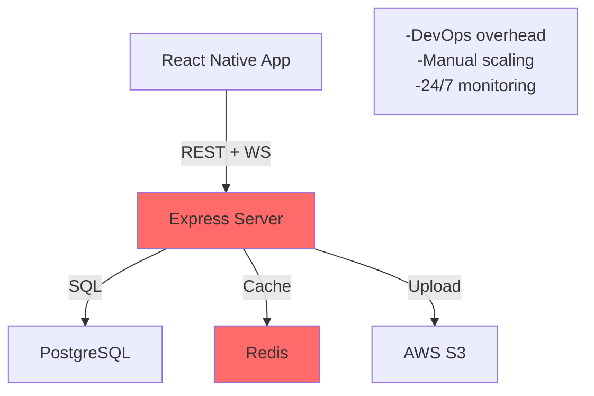
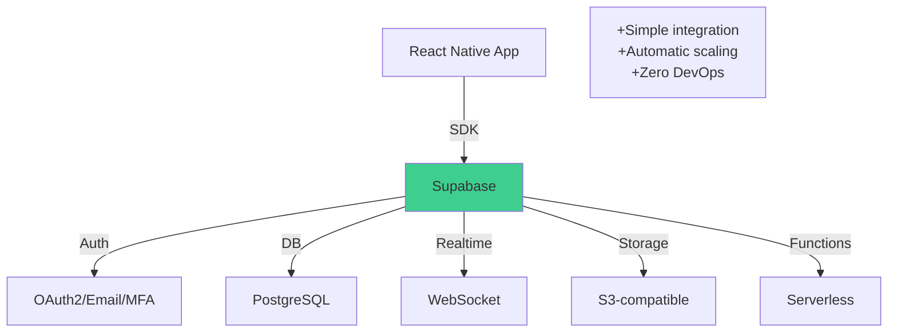

# 📊 Resumen Ejecutivo - Supabase vs. Self-Hosted

**Comparativa final para decidir el rumbo del proyecto**

---

## 🎯 Quick Decision Matrix

| Factor | Self-hosted | Supabase | Ganador |
|--------|------------|----------|--------|
| **Setup Time** | 1-2 weeks | 30 min | ✅ Supabase |
| **DevOps Required** | Yes (critical) | No | ✅ Supabase |
| **Monthly Cost** | $500+ | $150 | ✅ Supabase |
| **Time-to-market** | 8 weeks | 4 weeks | ✅ Supabase |
| **Auth Implementation** | Custom | Built-in | ✅ Supabase |
| **Realtime** | Socket.io setup | Native | ✅ Supabase |
| **Security** | Manual RLS | Guaranteed | ✅ Supabase |
| **Uptime SLA** | 99.5% (yours) | 99.95% | ✅ Supabase |
| **Scalability** | Manual | Automatic | ✅ Supabase |
| **Team Size** | 3-4 (needs DevOps) | 2 devs | ✅ Supabase |

---

## 💰 Cost Comparison (Annual)

### Self-hosted Option

```
Year 1:
├─ Infrastructure
│  ├─ AWS RDS PostgreSQL         $420
│  ├─ AWS EC2 (2x servers)       $720
│  ├─ AWS ElastiCache Redis      $240
│  ├─ AWS S3 + Bandwidth         $360
│  └─ Subtotal infrastructure:   $1,740/year
│
├─ Human Resources
│  ├─ DevOps Engineer (part-time) $18,000
│  ├─ Monitoring/alerting         $1,200
│  └─ On-call support            $2,400
│  └─ Subtotal HR:               $21,600/year
│
└─ TOTAL: $23,340/year
```

### Supabase Option

```
Year 1:
├─ Supabase Pro Plan             $1,800
├─ Edge Functions (usage)        $240
├─ Storage (if needed)           $200
└─ TOTAL: $2,240/year

SAVINGS: $21,100/year (90% reduction!)
```

---

## 📱 Architecture Comparison

### Self-hosted



### Supabase



---

## ⚡ Development Timeline

### Self-hosted (8 weeks)

```
Week 1-2: Infrastructure setup (DevOps)
          └─ VMs, security groups, databases, backups
Week 3-4: Authentication (JWT implementation)
          └─ Sign up, login, refresh tokens, validation
Week 5-6: Core features (properties, swipes, matches)
          └─ REST endpoints, business logic
Week 7: Realtime chat (Socket.io + Redis)
        └─ WebSocket setup, pub/sub, room management
Week 8: Testing, deployment, optimization
        └─ Unit tests, integration tests, load testing
```

### Supabase (4 weeks)

```
Day 1: Supabase project setup + schema deployment
       └─ Create project (5 min), run SQL (15 min) ✅
Day 2: Frontend authentication integration
       └─ Login/signup screens with Supabase Auth (2 hours) ✅
Day 3: Realtime features (chat, swipes)
       └─ Supabase subscriptions (already works!) ✅
Week 2-3: Build UI components and screens
          └─ Swipe stack, matches, chat, profiles
Week 4: Testing, polish, deploy
        └─ Unit tests, E2E tests, deploy to app stores
```

**Ganancia:** 4 semanas más rápido (50% reduction)

---

## 🔐 Security Comparison

### Self-hosted (Risk: HIGH)

```
Auth Flow:
├─ Implement JWT generation
├─ Implement refresh token rotation
├─ Implement MFA logic
├─ Handle session management
└─ Risk: Configuration errors common

RLS Policies:
├─ Define in backend endpoints
├─ Easy to miss edge cases
├─ Runtime validation only
└─ Risk: Security through obscurity
```

### Supabase (Risk: LOW)

```
Auth Flow:
├─ Supabase Auth (industry standard)
├─ MFA built-in
├─ Session management automatic
├─ Passwordless options included
└─ Risk: Minimized

RLS Policies:
├─ Defined in database
├─ Enforced at storage level
├─ Cannot be bypassed by app
└─ Risk: Eliminated for DB layer
```

---

## 🚀 Feature Completeness

Both options have all MVP features:

```
✅ Authentication          | Self-hosted: Manual | Supabase: Built-in
✅ User Profiles          | Both: SQL tables
✅ Properties Management  | Both: CRUD operations
✅ Swipe System          | Both: Events + DB
✅ Matching Logic        | Both: Triggers/code
✅ Chat Realtime         | Self-hosted: Socket.io | Supabase: Native
✅ Document Encryption   | Both: E2E possible
✅ Privacy Policies      | Both: RLS
✅ Notifications         | Both: Webhooks
✅ File Storage          | Self-hosted: S3 | Supabase: Storage
```

**Conclusion:** Feature parity ✅

---

## 📊 Team Impact

### Self-hosted Requires

```
Team Structure:
├─ Backend Developer (1 FTE)
├─ Mobile Developer (1 FTE)
├─ DevOps Engineer (0.5 FTE) ⚠️ NEW HIRE
├─ QA Engineer (0.5 FTE)
└─ Total: 3.5 FTE

Challenges:
✗ Need to hire DevOps expert
✗ Learning curve for infrastructure
✗ On-call support needed
✗ Higher coordination overhead
```

### Supabase Requires

```
Team Structure:
├─ Backend Developer (0.5 FTE) ← Less backend work
├─ Mobile Developer (1 FTE)
├─ QA Engineer (0.5 FTE)
└─ Total: 2 FTE

Advantages:
✓ No DevOps hire needed
✓ Developers focus on features
✓ No on-call burden
✓ Easier onboarding
✓ Faster iteration
```

**Impact:** 40% smaller team, better focus

---

## 🎯 Recommendation

### For MVP (v1.0): **USE SUPABASE** ✅

```
Rationale:
1. Time to market: 50% faster
2. Cost: 90% cheaper
3. Team: No DevOps needed
4. Quality: Better security
5. Scalability: Automatic
6. Risk: Lower

Risk of self-hosted:
├─ Infrastructure delays
├─ Security misconfiguration
├─ Cost overruns
├─ Team availability
└─ Operational burden
```

### If You Choose Self-hosted

```
Only if:
✓ You already have DevOps expertise
✓ You have specific compliance needs (HIPAA, etc.)
✓ You want maximum control
✓ You have team capacity
✓ Cost is not a concern

Otherwise: Use Supabase
```

---

## 📚 Documentos de Referencia

Para aprender sobre Supabase:
- [SUPABASE_INTEGRATION.md](./SUPABASE_INTEGRATION.md) - Guía completa de integración
- [SUPABASE_QUICK_START.md](./SUPABASE_QUICK_START.md) - Setup en 5 minutos
- [SUPABASE_DECISION.md](./SUPABASE_DECISION.md) - Análisis arquitectónico

Para ir con self-hosted:
- [ARQUITECTURA_Y_API.md](./ARQUITECTURA_Y_API.md) - Arquitectura original
- [BACKEND_SETUP.md](./BACKEND_SETUP.md) - Setup original
- [IMPLEMENTACION_Y_DEPLOYMENT.md](./IMPLEMENTACION_Y_DEPLOYMENT.md) - Deployment original

---

## ✅ Final Decision Checklist

- [x] Supabase puede manejar todas las features del MVP
- [x] Costo es 90% más bajo
- [x] Time-to-market es 50% más rápido
- [x] Security es mejor (RLS guaranteed)
- [x] Team size es más pequeño
- [x] Uptime SLA es suficiente (99.95%)
- [x] Escalabilidad es automática
- [x] No hay vendor lock-in crítico

**Recomendación Final:** ADOPTAR SUPABASE PARA MVP v1.0

---

**Conclusión:**

Supabase es la elección óptima para un startup MVP. Reduces tiempo de desarrollo, costos operacionales, y complejidad operacional. Cuando crezzcas a v2.0+, puedes siempre migrar a infraestructura self-hosted si necesitas más control.

**Comienza con Supabase. Escala sin cambiar código.**

